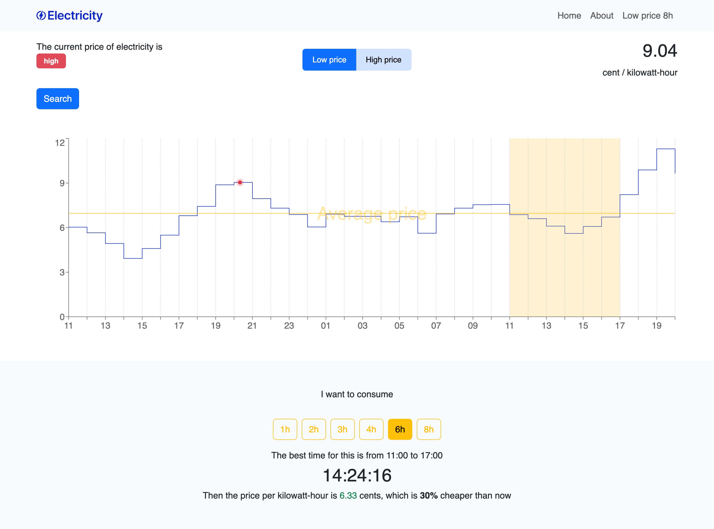

# Electricity Price Tracker

The Electricity Price Tracker is a web application designed to provide users with real-time insights into electricity prices, enabling informed decisions about energy consumption. It integrates seamlessly with the elering.ee API to retrieve up-to-date electricity price data. Users can search for prices based on specific date and time parameters, receive recommendations on cost-effective timeframes for energy usage, and analyze consumption history.

## Installation:

### `git clone https://github.com/lukashyna/elektrikell.git`

Clone the repository from GitHub.

### `cd elektrikell`

Navigate to the project directory.

### `npm install`

to install dependencies.

### `npm start`

to start the development server.

Open your browser and visit http://localhost:3000 to access the application.

## Features:

- **Real-time Price Monitoring:** Users can monitor real-time electricity prices to make informed decisions about energy consumption.
- **Search Functionality:** Search functionality allows users to specify date and time parameters to retrieve electricity price data.
- **Cost-Effective Timeframes:** The application provides recommendations on the most cost-effective timeframes for energy usage.
- **Data Analysis:** Users can analyze consumption history to better understand their energy usage patterns.
- **User-Friendly Interface:** The application features a user-friendly interface designed for ease of use and accessibility.

## Technologies Used:

- **React:** Used for building the user interface and managing search functionalities efficiently.
- **React Forms:** Employed for creating and processing search criteria, enabling users to specify date and time parameters.
- **React Hooks:** Used to manage state and side effects related to search queries and data retrieval.
- **Context API:** Manages global state related to search parameters and electricity price data, ensuring seamless communication between components.
- **React Router:** Handles client-side routing for navigation between search results and other views within the application.
- **Redux:** Manages global state and facilitates predictable state management across the application.
- **Recharts:** Utilized for data visualization, particularly for rendering interactive charts and graphs to display electricity price data.

## Contributing:

Contributions are welcome! Feel free to submit bug reports, feature requests, or pull requests to help improve the project.

## Author:

Anastasiia Lukashyna - Junior Front end developer.

Gamma Intelligence Training Centre

## Contact:

For inquiries or feedback, you can reach out to the author via email at anastasiia.lukashyna@gmail.com.
